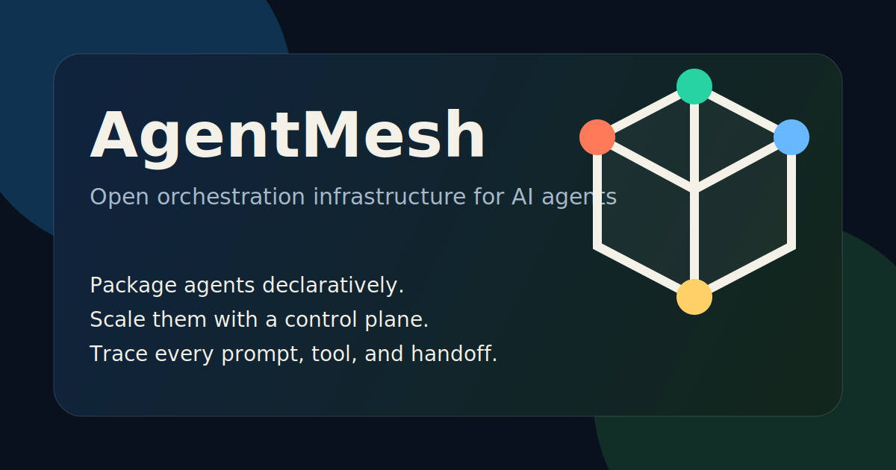

# AgentMesh



Open orchestration infrastructure for AI agents.

AgentMesh is a framework-agnostic control plane for deploying, scaling, coordinating, and observing autonomous agents in production. It is designed to do for agent workloads what modern orchestration did for containers: standardize packaging, runtime policy, and operational visibility without locking teams into one model vendor or framework.

## Why it matters

The first agent is easy. The fifth is where everything starts to break:

- prompts, tools, memory, and runtime config are packaged ad hoc
- queueing, retries, and backpressure live in app code
- handoffs are hard to reason about once multiple agents collaborate
- token usage, tool calls, and failures are scattered across dashboards
- teams get trapped in one cloud, one framework, or one provider

AgentMesh is the infrastructure layer beneath agent frameworks, not a replacement for them.

## What is in the repo today

- A runnable `meshctl` alpha CLI
- A local control plane that persists applied resources under `.agentmesh/state.json`
- JSON-based starter specs for `AgentPod` and `Workflow`
- Product docs for the long-term platform direction
- Brand assets for the repo and landing materials

## 60-second quickstart

Requires Python 3.9+.

```bash
python3 -m agentmesh.cli version
python3 -m agentmesh.cli init agentpod support-router -o examples/local/support-router.json
python3 -m agentmesh.cli apply examples/local/agentpod.json
python3 -m agentmesh.cli apply examples/local/workflow.json
python3 -m agentmesh.cli get
python3 -m agentmesh.cli describe support-router
python3 -m agentmesh.cli logs support-router
```

If you want the `meshctl` command directly:

```bash
python3 -m pip install -e .
meshctl version
```

## CLI surface

```text
meshctl version
meshctl init agentpod <name> [-o file]
meshctl init workflow <name> [-o file]
meshctl apply <file.json>
meshctl get
meshctl describe <name>
meshctl logs <name>
```

## Core primitives

- `AgentPod`: declarative deploy unit for one agent runtime
- `AgentSet`: replica management and autoscaling for homogeneous agents
- `Workflow`: DAG orchestration for multi-agent systems
- `ToolMount`: runtime attachment model for tools and external capabilities
- `MemoryVolume`: persistent and shareable memory abstraction
- `ControlPlane`: scheduling, policy, health, and resource coordination

## Alpha scope

This first implementation is intentionally narrow:

- local-only runtime
- JSON resource specs
- in-memory scheduling with local persisted state
- event logs for applied resources

YAML parsing, remote runtimes, autoscaling, and provider adapters are the next layer, not ignored requirements.

## Repository map

- [agentmesh/cli.py](/Users/jon/Documents/Playground/agentmesh/cli.py): `meshctl` entrypoint
- [agentmesh/runtime.py](/Users/jon/Documents/Playground/agentmesh/runtime.py): local control plane and persisted state
- [agentmesh/schema.py](/Users/jon/Documents/Playground/agentmesh/schema.py): resource models and scaffolds
- [examples/local/agentpod.json](/Users/jon/Documents/Playground/examples/local/agentpod.json): starter `AgentPod`
- [examples/local/workflow.json](/Users/jon/Documents/Playground/examples/local/workflow.json): starter `Workflow`
- [docs/vision.md](/Users/jon/Documents/Playground/docs/vision.md): product thesis and positioning
- [docs/architecture.md](/Users/jon/Documents/Playground/docs/architecture.md): system architecture overview
- [docs/roadmap.md](/Users/jon/Documents/Playground/docs/roadmap.md): phased delivery plan

## License

Apache-2.0
